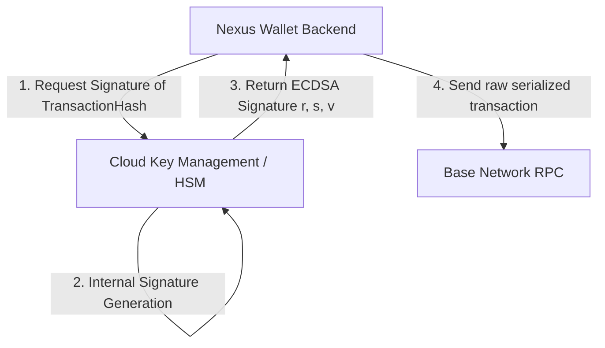

# Production Secrets Management Audit & KMS/HSM Migration Guide

This document presents a production secrets audit for the Nexus Smart Wallet backend and details the engineering design path for moving custodial wallet key material out of environment configuration and into secure Key Management Services (KMS) or Hardware Security Modules (HSMs).

---

## 1. Secrets & Sensitive Data Audit

A scan of the repository was performed to identify any sensitive configuration items, keys, and tokens.

| Secret Key | Scope | Risk | Current Mitigation |
|---|---|---|---|
| `MASTER_WALLET_PRIVATE_KEY` | EOA Custodial Signer (deployer/relayer) | **Critical** (Full funds compromise) | Loaded strictly from `.env`, never printed to logs or responses. Format validated at startup. |
| `JWT_SECRET` | Authentication tokens signature | **High** (Session spoofing) | Must be at least 32 characters long in production. Rejected if using dev defaults. |
| `ALCHEMY_API_KEY` | RPC Node & Paymaster endpoint | **Medium** (Billing / Quota exhaust) | Centralized config. Re-routed requests do not leak api key to client. |
| `PIMLICO_API_KEY` | Bundler & Paymaster endpoint | **Medium** (Billing / Quota exhaust) | Centralized config. Redacted automatically by structured logging. |

### Logs & Response Protection
- **Log Masking plugin:** Implemented inside `logger.ts`. It performs automated string replacements on standard private key signatures (`0x...` 64 hex characters) and bearer JWTs. It also parses nested objects passed to logs, checking for keys containing `password`, `key`, `secret`, `token`, `authorization`, `jwt`, `apikey` and redacting their values.
- **Mongoose Response filter:** Model-to-JSON serialisation rules ensure user passwords (`UserSchema.password`) and database inner version counters (`__v`) are deleted before transmitting data payloads.

---

## 2. HSM & KMS Production Migration Blueprint

Storing a raw private key in an environment variable (`MASTER_WALLET_PRIVATE_KEY`) is acceptable for POCs and staging, but presents a single point of failure in production. A production-grade system must sign transactions via remote cryptographic APIs without loading raw private key material into application memory.

### Target Architecture



---

## 3. Step-by-Step Migration Guide (AWS KMS / GCP Cloud KMS)

We recommend using **AWS KMS** (or **GCP Cloud KMS**) with an asymmetric key pair configured for **ECC_SEC_P256K1** (the secp256k1 curve used by Ethereum and EVM-compatible networks).

### Step 1: Remote Key Provisioning
1. Generate an asymmetric key pair in KMS:
   - Key type: `Asymmetric`
   - Key usage: `Sign and Verify`
   - Key spec: `ECC_SEC_P256K1`
2. Configure AWS IAM policies allowing the ECS/EKS container execution role permission to call `kms:Sign` on the specific key ARN.

### Step 2: Deriving the Ethereum Address
Since the public key is stored in KMS, the application must fetch it once at startup and derive the equivalent Ethereum address:
1. Call `GetPublicKey` on AWS KMS.
2. The response returns an ASN.1 DER-encoded public key.
3. Parse the DER structure to extract the uncompressed 64-byte public key coordinate.
4. Calculate the Keccak-256 hash of the 64-byte public key.
5. Take the last 20 bytes of the hash and format it as a checksummed hex string to get the Ethereum address (custodial signer address).

### Step 3: Remote Transaction Signing (Signing UserOperations)
Replace in-memory signing (e.g. `viem` `LocalAccount`) with a custom KMS signer class:

```typescript
import { KMSClient, SignCommand } from "@aws-sdk/client-kms";
import { secp256k1 } from "@noble/curves/secp256k1";
import { keccak256, serializeSignature } from "viem";

const kms = new KMSClient({ region: "us-east-1" });

export class KmsSigner {
    constructor(private keyId: string, public address: `0x${string}`) {}

    async signMessage({ message }: { message: { raw: `0x${string}` } }): Promise<`0x${string}`> {
        const hash = message.raw;

        const command = new SignCommand({
            KeyId: this.keyId,
            Message: Buffer.from(hash.slice(2), "hex"),
            MessageType: "RAW",
            SigningAlgorithm: "RSASSA_PKCS1_V1_5_SHA_256", // Or custom SECP256K1 algorithm supported by provider
        });

        const result = await kms.send(command);
        const signatureDer = Buffer.from(result.Signature!);

        // Parse DER signature into r and s parameters
        const sig = secp256k1.Signature.fromDER(signatureDer);
        let r = sig.r.toString(16).padStart(64, '0');
        let s = sig.s.toString(16).padStart(64, '0');

        // Ethereum signature malleability protection (EIP-2)
        const sBig = BigInt("0x" + s);
        const halfCurve = BigInt("0x7fffffffffffffffffffffffffffffff5d576e7357a4501ddfe92f46681b20a0");
        if (sBig > halfCurve) {
            const curveOrder = BigInt("0xfffffffffffffffffffffffffffffffebaaedce6af48a03bbfd25e8cd0364141");
            s = (curveOrder - sBig).toString(16).padStart(64, '0');
        }

        // Determine recovery parameter 'v' by validating derived address
        let v = 27; // Default or custom chain derivation offset
        // ...

        return serializeSignature({
            r: `0x${r}`,
            s: `0x${s}`,
            v: BigInt(v)
        });
    }
}
```

This ensures the private key never leaves the secure boundaries of the HSM, keeping the custodial wallet fully protected against local code execution flaws, file inclusion bugs, or server backups leaks.
