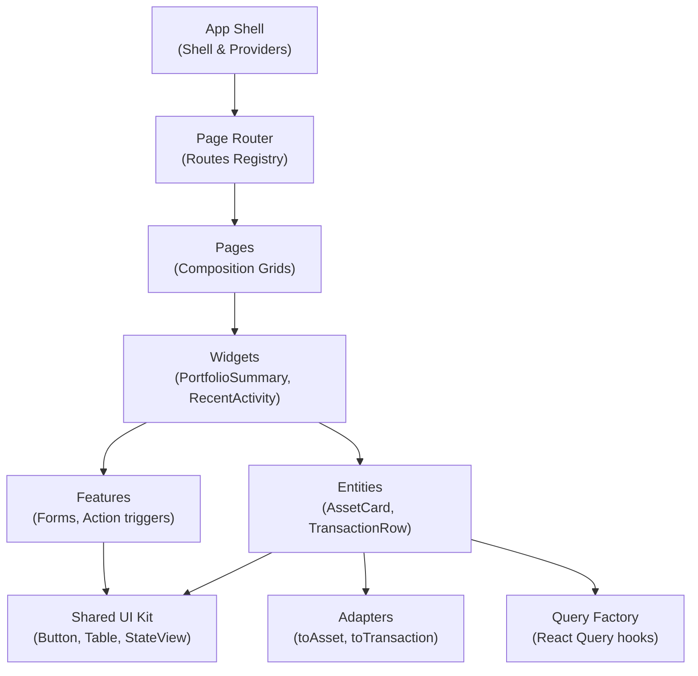
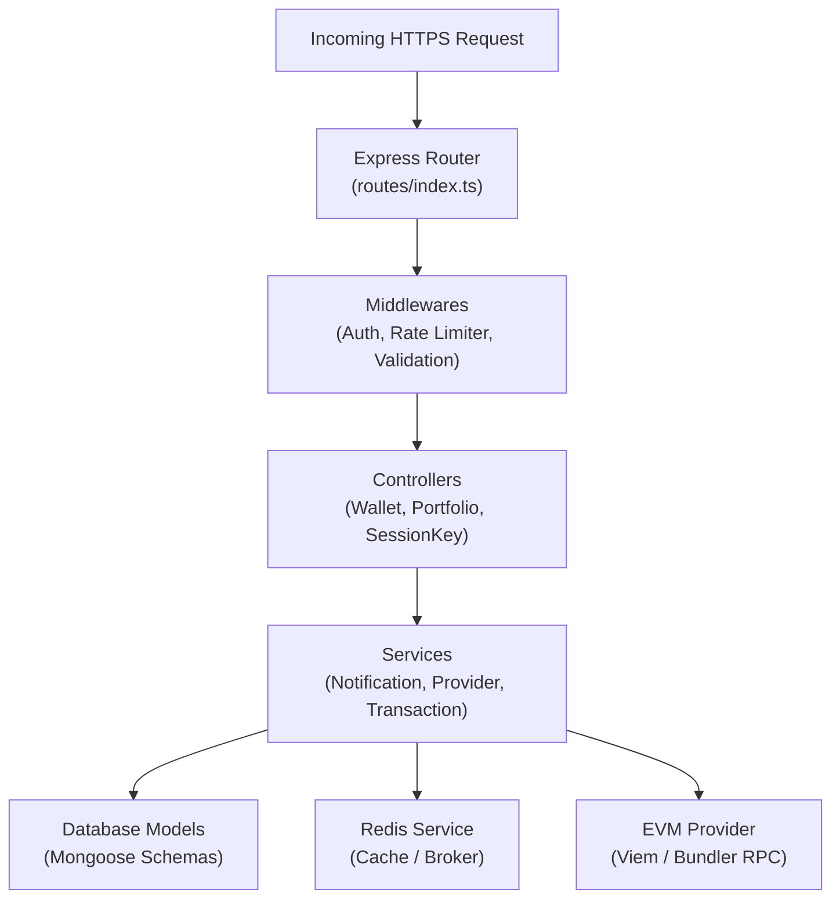

# C4 Architecture — Level 3: Components

This document details the internal component structures for the React Frontend and Express Backend containers.

---

## 1. Frontend SPA Components (React & FSD)

The frontend uses Feature-Sliced Design to partition internal components:

### Component Details
* **App Shell & Providers**: Wraps the app in global contexts (`ThemeProvider`, `NotificationProvider`, Redux Store, React Query Client).
* **Page Router**: Maps route IDs defined in `src/app/config/routes.ts` to visual pages.
* **Widgets**: The functional composition units (e.g. `PortfolioSummary`, `RecentActivity`).
* **Features & Mutations**: Implements specific interactions (e.g., login, session key creation) calling mutations.
* **Entities & Queries**: Fetches domain schemas and caches them via React Query, processing raw JSON response arrays through Adapters before mounting them.
* **Shared UI**: Stateless, wallet-agnostic visual controls (Forms, Tables, Charts, Fallbacks).

---

## 2. Backend API Components (Express)

The backend follows a layered MVC-Service structure:

### Component Details
* **Router & Middleware**: Intercepts requests, validates inputs (using Zod), enforces sliding rate limits, and extracts authorization JWTs.
* **Controllers**: Sanitizes inputs, delegates requests to core services, and structures JSON response envelopes.
* **Services**:
  * **Provider Service**: Manages Viem client instantiation, network connections, and smart account contract deployments.
  * **Transaction Service**: Manages transaction queue states, processes optimistic nonces (`getNextNonce`), and interacts with the Pimlico / Alchemy RPC bundlers.
  * **Notification Service**: Manages Redis Pub/Sub subscriber queues and distributes real-time events to active client sockets.
  * **Redis Service**: Abstracts cache storage and rate limiter buckets.
* **Database Models**: Mongoose schemas representing collections in MongoDB (`User`, `SmartAccount`, `SessionKey`, `Transaction`).
