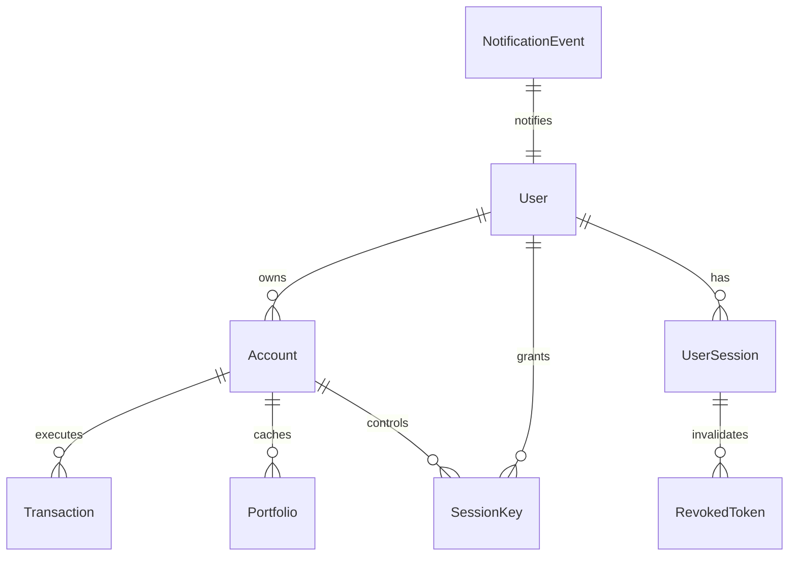

# Database Schemas & Relationships

The database layer utilizes MongoDB to manage user accounts, smart wallets, and execution state.

## 📊 Entity Relationship Diagram

## 📁 Key Collections
* **users:** Stores user emails, usernames, theme preferences, and bcrypt password hashes.
* **accounts:** Maps user IDs to smart wallet addresses and configurations.
* **transactions:** Tracks transaction details (to, value, data), userOperation hashes, and execution states.
* **sessionkeys:** Stores session keys target whitelists, expiry times, and owner signatures.
* **portfolios:** Caches current on-chain asset balances (Native, ERC20, NFTs) for fast loading times.

Related Pages:
* [Mongoose Models](file:///home/dev-var/Personal/Projects/nexus-smart-wallet/docs/backend/models.md)
* [DR Databases](file:///home/dev-var/Personal/Projects/nexus-smart-wallet/docs/operations/disaster-recovery.md)
