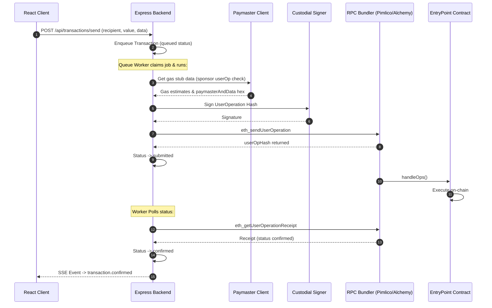

# ERC-4337 Architecture & Flows

The Nexus Smart Wallet utilizes the ERC-4337 account abstraction standard.

## 🔄 UserOperation Submission Flow

## ⚙️ Core Components
* **EntryPoint Contract:** The entry point for executing all ERC-4337 operations (EntryPoint 0.7 used by default; EntryPoint 0.6 fallback for Trust accounts).
* **Paymaster:** Sponsors gas fees (returns gas estimates and `paymasterAndData` signatures).
* **Bundler:** Relays the userOperations to the Entrypoint contract.

Related Pages:
* [FIFO Nonce Queue](queue.md)
* [Transactions API](file:///home/dev-var/Personal/Projects/nexus-smart-wallet/docs/api/transactions.md)
