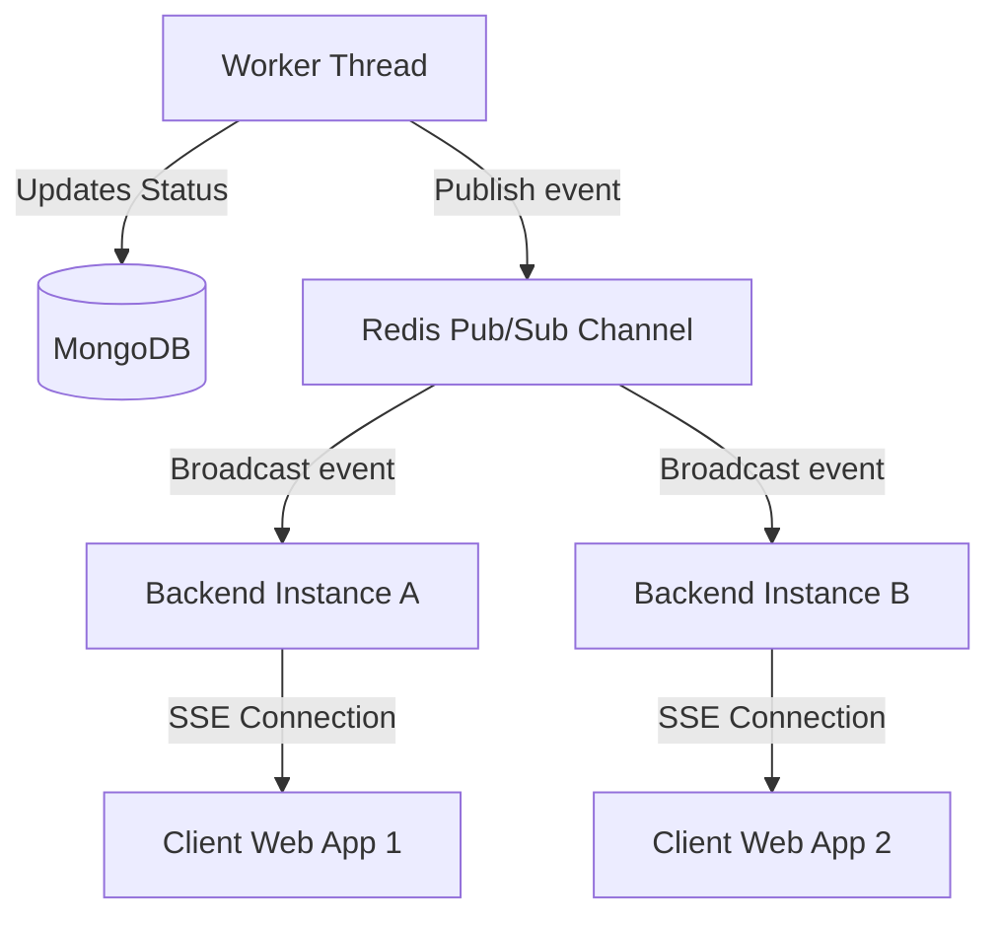

# Server-Sent Events Clustered Notifications

Real-time transaction status updates are pushed to clients using Server-Sent Events (SSE) combined with a Redis Pub/Sub backend.

## 📡 SSE Connection and Broadcast Architecture

## 🔄 Missed Event Recovery
* **Event Logging:** Every notification is logged in MongoDB with a unique event ID (`timestamp-uuid`) and a 24-hour TTL.
* **Last-Event-ID Header:** When a client reconnects, it sends its last received event ID via the `Last-Event-ID` header. The server queries MongoDB for any missed events since that timestamp and replays them to prevent data loss.
* **Heartbeat:** Pings are sent to clients every 15 seconds to keep the connections alive and prune stale sockets.

Related Pages:
* [Notifications API](file:///home/dev-var/Personal/Projects/nexus-smart-wallet/docs/api/notifications.md)
* [Redis Caching](redis.md)
