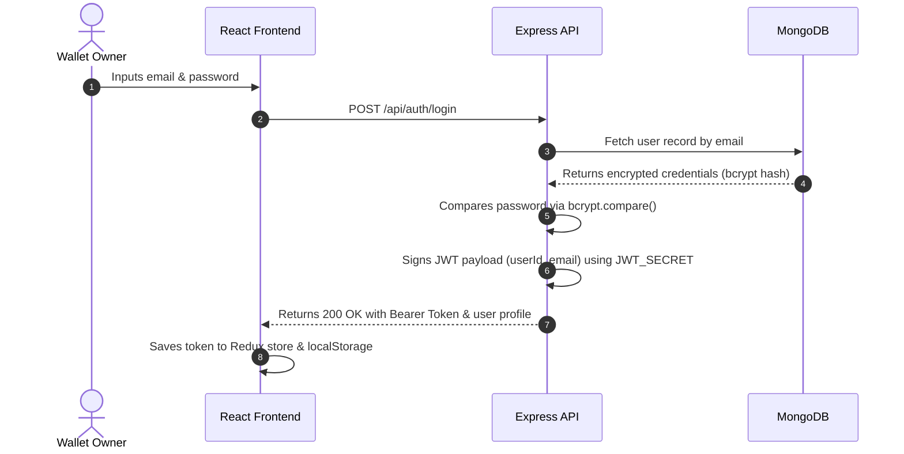
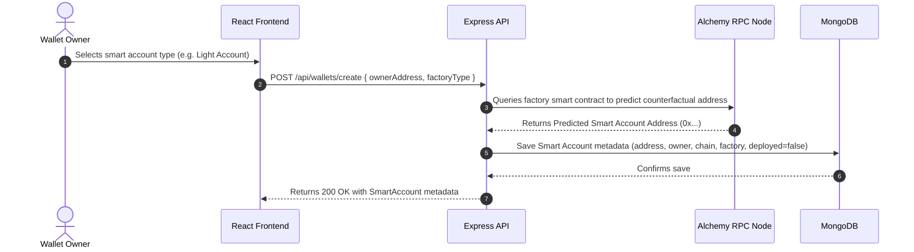
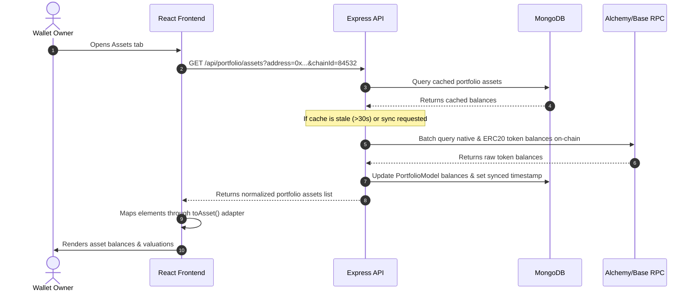
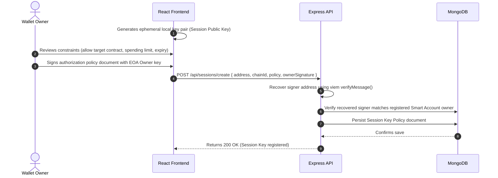
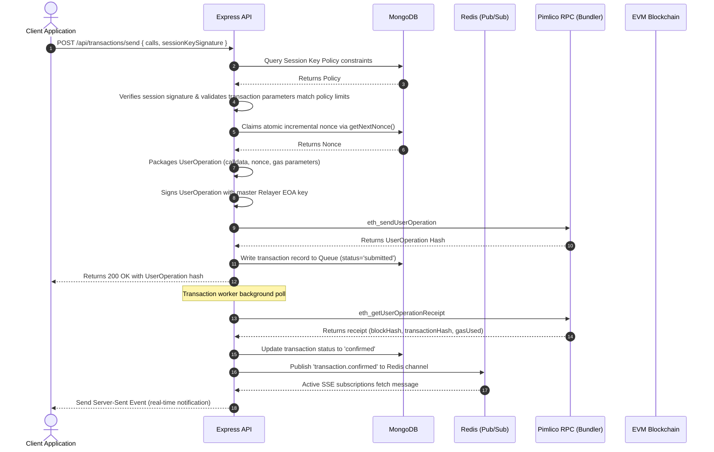
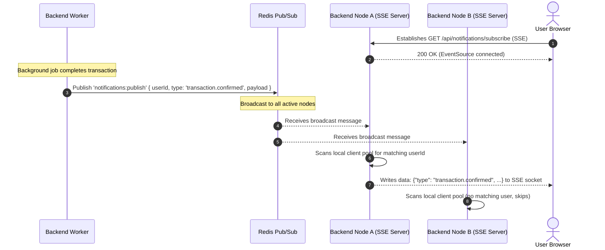
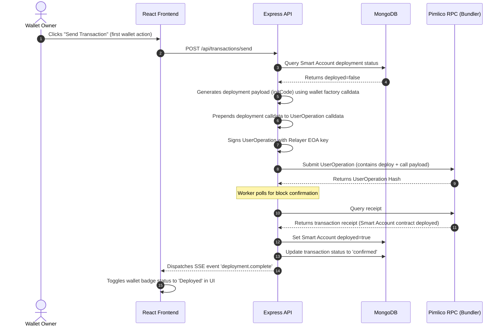

# C4 Architecture — Sequence Diagrams

This document details the step-by-step cryptographic and network execution flows for key wallet operations.

---

## 1. User Authentication Flow

This flow validates user credentials and returns a secure JWT:

---

## 2. Smart Wallet Creation Flow

This flow predicts and registers a new ERC-4337 smart wallet counterfactual address:

---

## 3. Portfolio Asset Refresh Flow

This flow syncs on-chain balances with the database cache for fast front-end queries:

---

## 4. Session Key Registration Flow

This flow registers a cryptographic session key with restricted execution scopes:

---

## 5. Transaction Execution Flow (with Session Key)

This flow validates scopes, claims nonces, submits UserOperations, and polls confirmations:

---

## 6. Real-time Notification Dispatch Flow

This flow distributes events in a horizontal cluster using Redis Pub/Sub:

---

## 7. Smart Wallet Deployment Flow

This flow handles counterfactual smart account deployment alongside transaction execution:

