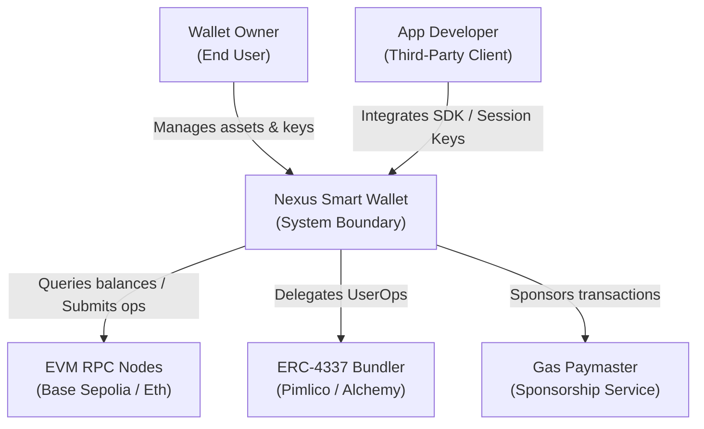

# C4 Architecture — Level 1: System Context

This document details the System Context for the Nexus Smart Wallet platform, illustrating how users and third-party systems interact with the platform.

---

## 1. System Context Diagram

The following diagram shows the user actors, the system boundary, and external blockchain integrations:

---

## 2. Element Catalog

### Actors
| Element | Type | Description |
| :--- | :--- | :--- |
| **Wallet Owner (End User)** | Human | The final user who creates smart accounts, reviews portfolio assets, registers session keys, and executes transfers. |
| **App Developer (Third-Party)** | Human / System | Third-party developer who integrates the Nexus session keys into applications (e.g. games) to perform transaction actions. |

### Systems
| Element | Type | Description |
| :--- | :--- | :--- |
| **Nexus Smart Wallet** | Software System | The system boundary consisting of the React frontend, Express API gateway, MongoDB data store, and Redis transaction queue. |

### External Dependencies
| Element | Type | Description |
| :--- | :--- | :--- |
| **EVM RPC Nodes** | Software System | Public RPC endpoints (such as Base Sepolia) used to check balances, deploy factory accounts, and query smart contract states. |
| **ERC-4337 Bundler** | Software System | Services that package UserOperations into standard blocks and execute them on-chain (e.g. Pimlico). |
| **Gas Paymaster** | Software System | Smart contracts and APIs that sponsor gas fees for users, removing the requirement to hold native gas tokens (e.g., Alchemy Paymaster). |
