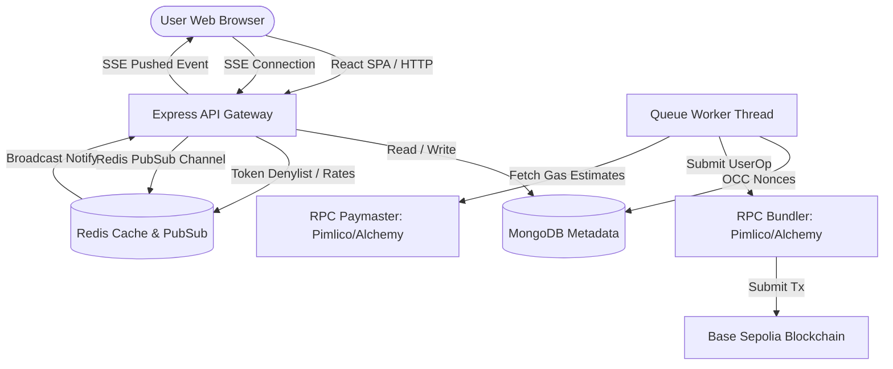

# System Architecture Context

Nexus Smart Wallet splits client-side presentation from core ERC-4337 smart wallet mechanics. To optimize mobile/web battery life and speed, all heavy operations (assembling userOperations, fetching RPC gas price history, checking paymaster stub sponsorships) run on the Express backend.

## 🏗️ System Integration Diagram

## 🔌 Third-Party Integrations
* **Alchemy / Pimlico Bundlers:** Used to relay userOperations. Resolved dynamically depending on selected `walletID` and `chainId`.
* **Pimlico Gas Estimators:** Utilized to fetch gas oracle price data.
* **permissionless.js:** Integrates the Smart Account contracts on-chain (Base Sepolia) with backend Viem clients.

Related Pages:
* [Backend Architecture](backend.md)
* [ERC-4337 Integration](erc4337.md)
