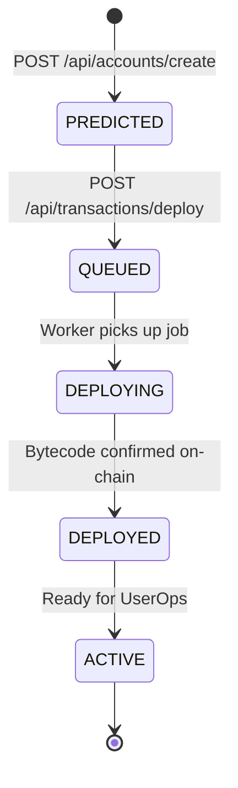

# Smart Account Lifecycle

Nexus Smart Wallet manages Smart Contracts from predictions to active deployments.

## 🔄 Lifecycle Stages

## 🛠️ predicting and Deploying Accounts
1. **Prediction:** On signup/smart account creation, the backend predicts the counterfactual address using the factory contract address and owner EOA. No gas is spent; the account status is stored as `isDeployed: false`.
2. **Deployment:** The account is deployed during its first transaction (counterfactual deployment) or explicitly via `/api/transactions/deploy`.
3. **Reconciliation Worker:** A background cron sweeps all `isDeployed: false` accounts every 30 seconds and audits their addresses for on-chain bytecode. If found, it marks them `isDeployed: true`.

Related Pages:
* [Smart Account Routes](file:///home/dev-var/Personal/Projects/nexus-smart-wallet/docs/api/accounts.md)
* [Background Workers](file:///home/dev-var/Personal/Projects/nexus-smart-wallet/docs/backend/workers.md)
